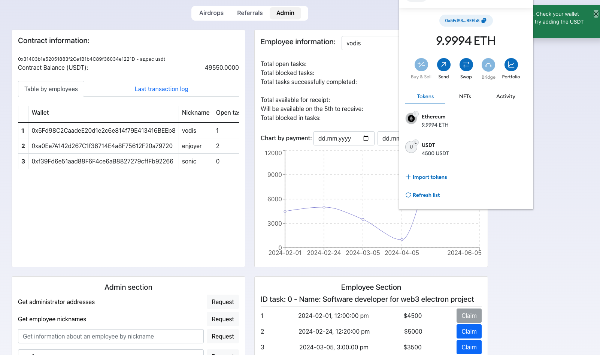
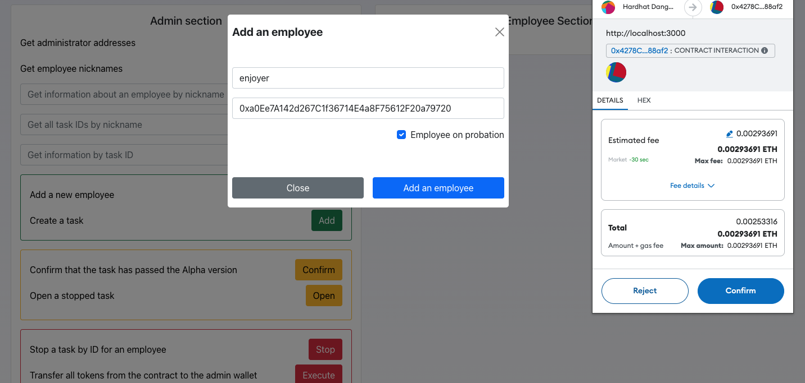
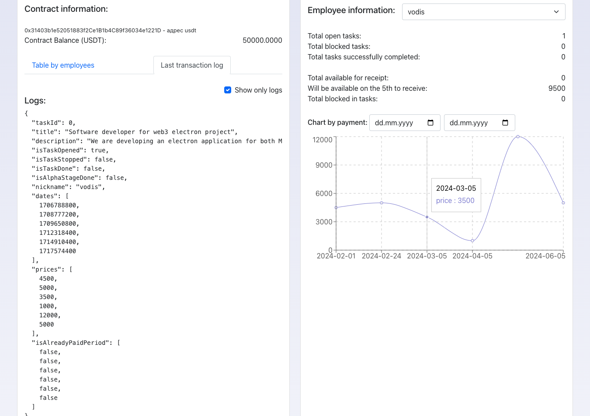
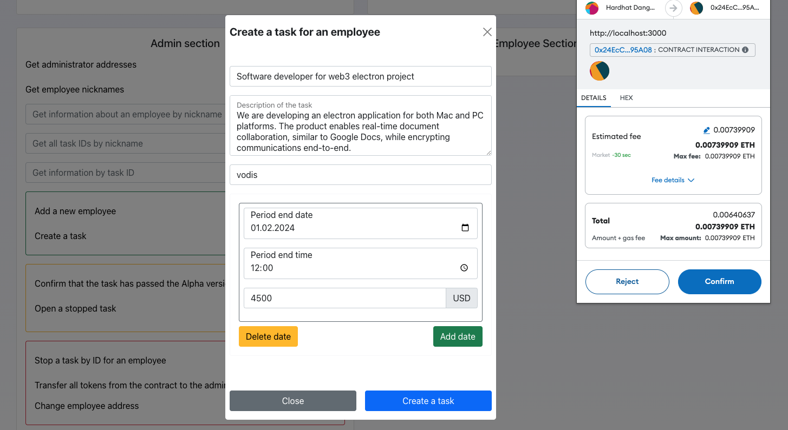
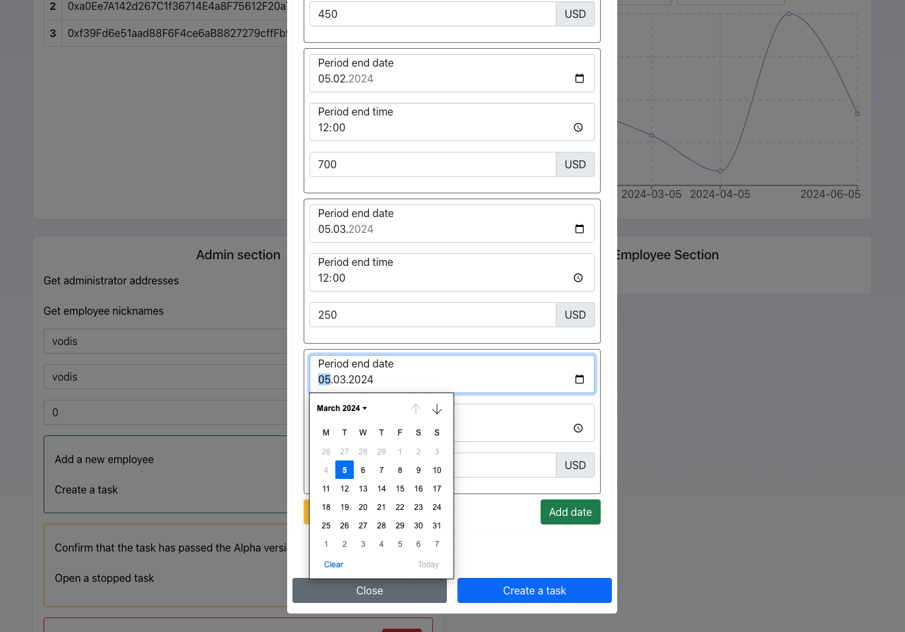

## Intro to Employee Salary Claim application

Welcome to the Employee Salary Claim App repository. The main aim of the application is to allow the employer (administrator) to create tasks for employees with deadlines and stage periods. Stage period, which must be approved by employer is kind of a gateway which opens for employees ability to claim their funds for specific period, and then repeatedly claim remain on specified period till all payment will be issued.

After each deployment contract addresses have to be changed. File to apply changes is: `/src/utils/ethereum/ethereumFunctions.js` with next functions:

- getRefContractForChargeVesting
- getRefContractForTaskManager
- getRefContractForEmployeeManager

## Documentation

Applications was build by react. You can find the React documentation [on the website](https://react.dev/).  

## How it looks like?

Add employee             |  TX Logs
:-------------------------:|:-------------------------:
  |  

Create single period task             |  Create multi period task
:-------------------------:|:-------------------------:
  |  
